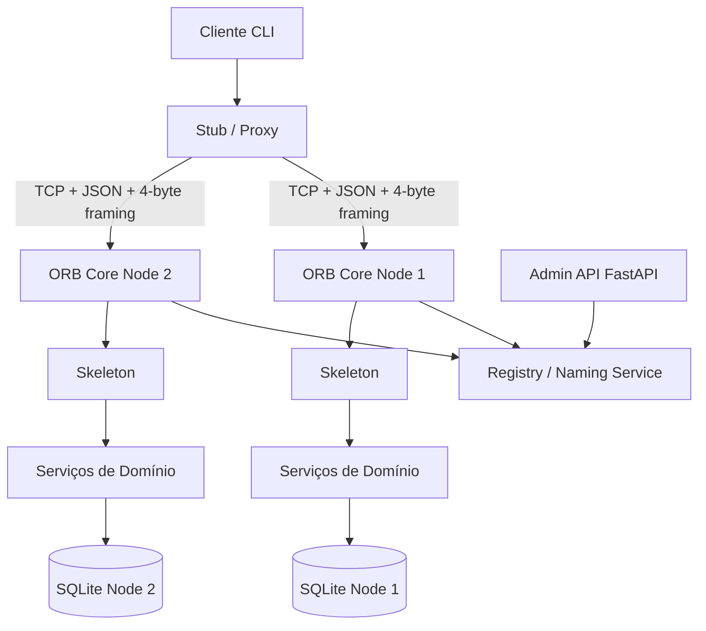

# Arquitetura do Middleware ORB

## Visão geral

## Componentes

- **Stub**: cria `request_id`, timestamp e envelope JSON, abre TCP, envia a
  chamada, valida a resposta e converte timeout/conexão recusada em exceções
  customizadas. Quando há Registry, resolve endpoints por round-robin e tenta
  outro nó durante o retry.
- **ORB Core / Broker**: aceita cada conexão em uma coroutine `asyncio`, valida
  JWT para métodos protegidos, localiza o objeto local por `object_id`, chama o
  Skeleton e devolve envelope `OK` ou `ERROR`.
- **Skeleton**: limita o dispatch a métodos públicos e encaminha os argumentos
  para a instância real do serviço.
- **Serializer**: único ponto de JSON e framing. Cada payload UTF-8 é precedido
  por tamanho de 4 bytes em big-endian.
- **Registry Service**: processo TCP separado que registra endpoints e resolve
  múltiplas instâncias de um objeto com round-robin em memória.
- **Serviços de domínio**: implementam catálogo, usuários e empréstimos. As
  operações de estoque usam transações SQLite.
- **Admin API**: oferece somente observabilidade (`/health`, `/logs`, `/docs`),
  sem substituir o protocolo de invocação remota.

## Fluxo de uma chamada

1. O Cliente autentica no `UsuarioService` e recebe JWT.
2. O Stub resolve `object_id` no Registry ou usa endpoint configurado.
3. O Stub serializa o envelope e envia o framing pelo TCP.
4. O Broker desserializa, valida o token e despacha pelo Skeleton.
5. O serviço de domínio consulta ou altera SQLite.
6. O Broker serializa o resultado com o mesmo `request_id`.
7. O Stub retorna o resultado ou uma exceção ORB tratada.

## Falhas e observabilidade

O timeout padrão é 5 segundos. O Stub faz até três tentativas com backoff de
0,5, 1 e 2 segundos. Falhas finais resultam em `CONNECTION_REFUSED` ou `TIMEOUT`.
Logs usam timestamp ISO8601, nível, componente e `request_id`; tokens e senhas
não são registrados.

## Vantagens

- Mostra explicitamente marshalling, framing, naming, dispatch e skeleton.
- Mantém o Cliente desacoplado da localização dos objetos.
- O Registry e o round-robin permitem demonstrar multinode com poucas peças.
- A camada de erros e retry evita que detalhes de socket vazem para o usuário.
- SQLite e dependências pequenas facilitam execução local e apresentação.

## Limitações

- O Registry é em memória e não possui persistência ou consenso distribuído.
- Os bancos dos nós são independentes; consistência distribuída entre réplicas
  não é objetivo desta etapa.
- O protocolo não usa TLS e não pretende ser adequado para produção sem camada
  de segurança de transporte.
- Retry de chamadas mutáveis exige cautela em caso de falha depois da execução;
  idempotência distribuída não é implementada nesta etapa.
- O serviço é uma demonstração acadêmica, não uma plataforma de RPC geral.
