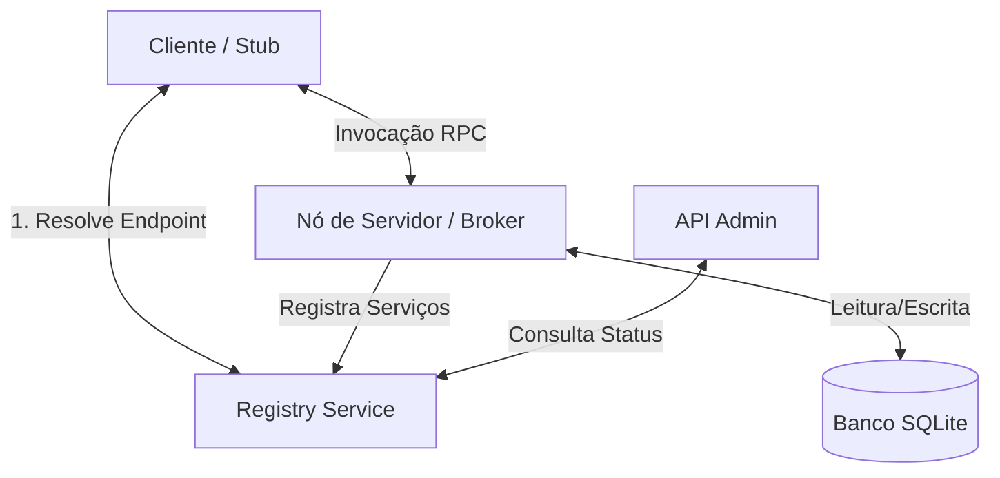
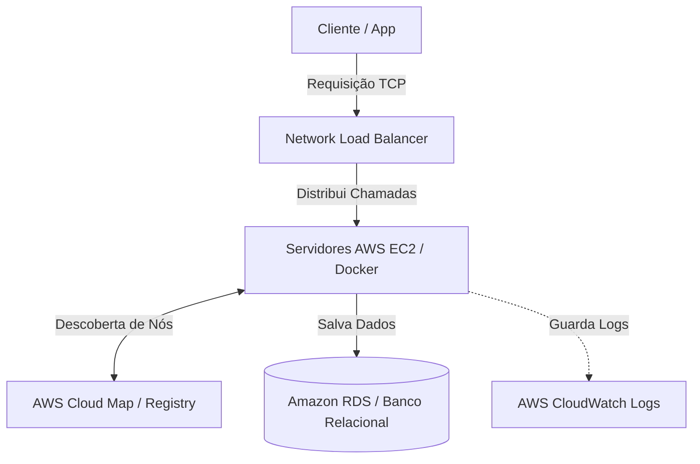

# Relatório de Arquitetura - Middleware ORB Biblioteca Digital

Este documento apresenta uma visão detalhada do projeto, descrevendo a função de cada componente, a utilidade de cada servidor e o fluxo de comunicação ponta a ponta do middleware **ORB (Object Request Broker)**.

---

## 1. Visão Geral do Sistema

O projeto implementa um **Middleware de Invocação Remota de Objetos (ORB)** construído do zero sobre conexões TCP puras utilizando a biblioteca `asyncio` do Python. Ele simula uma arquitetura distribuída de uma biblioteca digital, onde o cliente interage com serviços de domínio (Livros, Usuários e Empréstimos) localizados em servidores remotos (Nós), sem precisar conhecer o IP ou a porta desses servidores diretamente.

---

## 2. Descrição dos Componentes e Servidores

O projeto é modularizado de modo a separar a infraestrutura de comunicação (Middleware), a lógica de negócio (Domínio) e as ferramentas de gerenciamento (API Admin e Banco de Dados).

### 🛠️ O Middleware (`orb_core`)
É o coração do sistema, responsável por toda a comunicação em rede, serialização, autenticação e despacho de chamadas.

*   **`serializer.py`**: Define o protocolo de comunicação. Mensagens JSON são transformadas em bytes. Para evitar que os dados se misturem no fluxo TCP, é adicionado um **cabeçalho de 4 bytes** (`struct.pack("!I", len(payload))`) no início de cada mensagem contendo o seu tamanho (enquadramento por prefixo de comprimento - *framing*).
*   **`stub.py`**: O **Stub** (ou proxy) fica do lado do cliente. Ele finge ser o objeto real. Quando o cliente chama um método (ex: `listarLivros`), o Stub intercepta os argumentos, consulta o `RegistryClient` para descobrir em qual servidor (nó) o objeto real está e envia a requisição formatada via TCP. Ele também gerencia o **failover** (se um nó falha, ele tenta outro) e **retries** (3 tentativas com atraso progressivo).
*   **`broker.py`**: O **Broker** roda nos nós servidores. Ele escuta conexões TCP e recebe as requisições de invocação dos stubs. É responsável também por validar a segurança das chamadas protegidas utilizando o token JWT e passar os parâmetros para o *Skeleton*.
*   **`skeleton.py`**: O **Skeleton** (esqueleto) recebe a mensagem desempacotada pelo Broker e faz a chamada local do método do objeto real utilizando introspecção (`getattr(instance, method)`). Ele aguarda o resultado e o devolve para o Broker enviar de volta ao cliente.
*   **`auth.py`**: Utilitário que gera e valida tokens **JWT (JSON Web Tokens)** para autenticar as requisições de segurança entre clientes e servidores.

---

### 🌐 Os Servidores / Processos

#### A. Naming Service / Servidor de Registro (`registry_service`)
*   **Para que serve:** Funciona como a "lista telefônica" do sistema distribuído.
*   **Como funciona:** Ele expõe um socket TCP (porta padrão `8765`). Quando os nós servidores iniciam, eles se registram no Registry informando quais serviços possuem e em qual IP/porta estão. Quando um cliente quer falar com um serviço (ex: `UsuarioService`), ele pergunta ao Registry, que responde com o endpoint adequado usando o algoritmo **Round-Robin** (alternando as chamadas entre os nós disponíveis para balancear a carga).

#### B. Nós de Execução (`server` / `node_1` e `node_2`)
*   **Para que serve:** São os servidores de aplicação que de fato processam as regras de negócio e acessam o banco de dados.
*   **Como funciona:** Cada nó (Node 1 na porta `9001` e Node 2 na porta `9002`) inicia um `Broker`, cria instâncias dos serviços de domínio (`LivroService`, `UsuarioService` e `EmprestimoService`), associa cada um deles a um banco de dados SQLite próprio e registra seus endpoints no **Registry**.

#### C. API Administrativa (`admin_api`)
*   **Para que serve:** Fornece um painel de observabilidade e monitoramento de saúde do ecossistema.
*   **Como funciona:** Trata-se de um servidor HTTP FastAPI independente. Ele disponibiliza endpoints HTTP (como `/health` e `/logs`) e documentação interativa Swagger. Ele consulta o *Registry* para mostrar quais nós estão de pé e lê o arquivo de logs (`orb.log`) para mostrar as transações que ocorreram no middleware.

---

### 📁 Outros Diretórios

*   **`domain`**: Contém a lógica de negócio real e interações com o banco de dados SQLite para as entidades `Livro`, `Usuario` e `Emprestimo`.
*   **`database`**: Gerencia a conexão SQLite (`connection.py`) e o preenchimento de dados iniciais de demonstração (`seed.py`).
*   **`client`**: Contém exemplos de clientes que iniciam fluxos de teste e demonstram chamadas ponta a ponta dos stubs do ORB.

---

## 3. Fluxo de Execução de uma Invocação Remota

Abaixo é descrito o caminho que uma chamada de método faz, por exemplo: `await livro_service.listarLivros()`

1.  **Cliente invoca o Stub:** O cliente chama o método de listagem pelo stub cliente.
2.  **Resolução de Endpoint:** O stub entra em contato com o *Registry* (`127.0.0.1:8765`), pergunta onde está o `LivroService` e recebe de volta o endereço do Node 1 (`127.0.0.1:9001`) ou Node 2 (`127.0.0.1:9002`).
3.  **Serialização e Envio:** O stub serializa a chamada (nome do método, argumentos e token JWT) em JSON com o cabeçalho de 4 bytes e envia via TCP para o nó escolhido.
4.  **Processamento no Broker:** O Broker do nó recebe os bytes, reconstrói o JSON usando o tamanho indicado no cabeçalho e valida o JWT se o método for protegido.
5.  **Execução no Skeleton:** O Skeleton invoca localmente a classe `LivroService` no banco de dados SQLite do nó e obtém a lista de livros do banco.
6.  **Retorno da Resposta:** O resultado é empacotado de volta pelo Broker no mesmo formato TCP enquadrado e enviado para o Stub, que o entrega de forma transparente como o retorno da função assíncrona do Python para o código cliente.

---

## 4. Proposta de Arquitetura na Nuvem (AWS - Grupo 6)

Para atender ao **Requisito 10 (Integração com AWS - Comunicação entre Serviços Distribuídos)**, a proposta mapeia o projeto local para **4 serviços básicos e clássicos da AWS**:

### Mapeamento Direto e Simples

1. **AWS EC2 (ou ECS)**: Roda os contêineres Docker do nosso **Broker** e dos nossos nós de servidor (`node_1` e `node_2`).
2. **AWS Cloud Map**: Substitui o nosso `registry_service` local, funcionando como a "lista telefônica" na nuvem para que os nós e clientes se localizem.
3. **AWS Network Load Balancer (NLB)**: Recebe as conexões TCP do cliente e distribui entre os nós do servidor.
4. **Amazon RDS**: Substitui o banco de dados SQLite local por um banco relacional gerenciado na nuvem.
5. **AWS CloudWatch**: Armazena o arquivo de logs (`orb.log`) e métricas do sistema.

---

## 5. Conclusão

A solução na nuvem substitui os componentes locais por serviços equivalentes da AWS, mantendo a comunicação distribuída entre o cliente e os nós do servidor de forma simples, escalável e segura.

